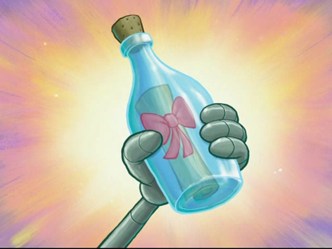

## 🔥 Premise
This site was built using [GitHub Pages](https://pages.github.com/) and uses the Phantom design from [HML5 UP](https://html5up.net).

Edited by Virginia Lane Colquett.

This [website](https://vlcolquett.github.io/lemonade) features four friends, a 🏀 basketball bracket and the loser hosting a 🍋 lemonade stand. 

## 🎯 Features
<details>
<summary>Carousel</summary>

  ```html
  <div class="slideshow-container">
  
  <div class="mySlides fade">
    <div class="numbertext">1 / 2</div>
    
  </div>
  
  <div class="mySlides fade">
    <div class="numbertext">2 / 2</div>
    
  </div>
  
  <a class="prev" onclick="plusSlides(-1)">❮</a>
  <a class="next" onclick="plusSlides(1)">❯</a>
  
  </div>
    
  <div style="text-align:center">
  <span class="dot" onclick="currentSlide(1)"></span> 
  <span class="dot" onclick="currentSlide(2)"></span> 
  
  </div>
  <script>
  let slideIndex = 1;
  showSlides(slideIndex);
  
  function plusSlides(n) {
      showSlides(slideIndex += n);
    }
  				
  function currentSlide(n) {
      showSlides(slideIndex = n);
  }
  				
  function showSlides(n) {
      let i;
      let slides = document.getElementsByClassName("mySlides");
      let dots = document.getElementsByClassName("dot");
      if (n > slides.length) {slideIndex = 1}    
      if (n < 1) {slideIndex = slides.length}
      for (i = 0; i < slides.length; i++) {
        slides[i].style.display = "none";  
      }
      for (i = 0; i < dots.length; i++) {
        dots[i].className = dots[i].className.replace(" active", "");
      }
      slides[slideIndex-1].style.display = "block";  
      dots[slideIndex-1].className += " active";
  }
  </script>
```
</details>
<details>
<summary>Card Flip</summary>
  
  ```html
  <div class="scene scene--card">
  <div class="card">
  <div class="card__face card__face--front">
    something on top side of card
  </div>
  <div class="card__face card__face--back">
    something on back side of card
  </div>
  </div>
  </div>
  
  <script>
  var cards = document.querySelectorAll('.card');
  
  [...cards].forEach((card)=>{
    card.addEventListener( 'click', function() {
      card.classList.toggle('is-flipped');
    });
  });
  </script>
  ```
</details>
<details>
<summary>Eternal Scroll and YouTube Embeds</summary>
This next block of code is verbatum. It is a sub-area where the user scrolls down a bit and when they click the button, they open up Rick Astley's 'Never Gonna Give You Up' music video amd get Rick Rolled 😆

```html
<div class="col-12 scrollable" id="scrolled">
    <p style="line-height: 1; margin:0 0 .5cm;">Hmmm wonder what is at the bottom of the ocean???</p>
    <span class="image fit" style=" margin: 0cm;"></span>
    <span class="image fit" style=" margin: 0cm;"></span>
    <span class="image fit" style=" margin: 0cm;"></span>
    <span class="image fit" style=" margin: 0cm;"></span>
    <span class="image fit" style=" margin: 0cm;"></span>
    <span class="image fit" style=" margin: 0cm;"></span>
    <span class="image fit" style=" margin: 0cm;"></span>
    <span class="image fit" style=" margin: 0cm;"></span>
    <div id="rickroll"></div>
    <a class="button primary fit" onclick="rickroll()">CLICK ME</a>
</div>
<script>
function rickroll(){
  document.getElementById("rickroll").innerHTML = '<iframe class="image fit" src="https://www.youtube-nocookie.com/embed/dQw4w9WgXcQ?autoplay=1" title="YouTube video player" frameborder="0" allow="accelerometer; autoplay; clipboard-write; encrypted-media; gyroscope;   picture-in-picture; web-share" allowfullscreen allow="autoplay"></iframe>'
  var objDiv = document.getElementById("scrolled");
  objDiv.scrollTop = objDiv.scrollHeight;
}
</script>
```
</details>
